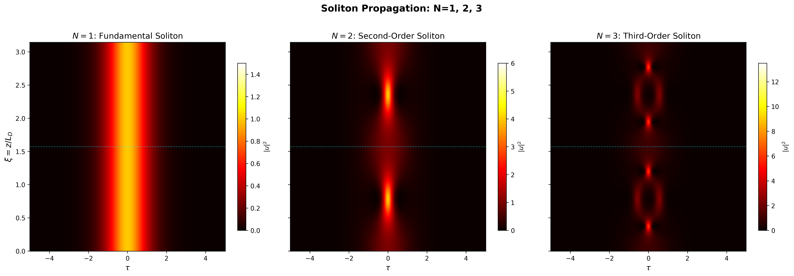
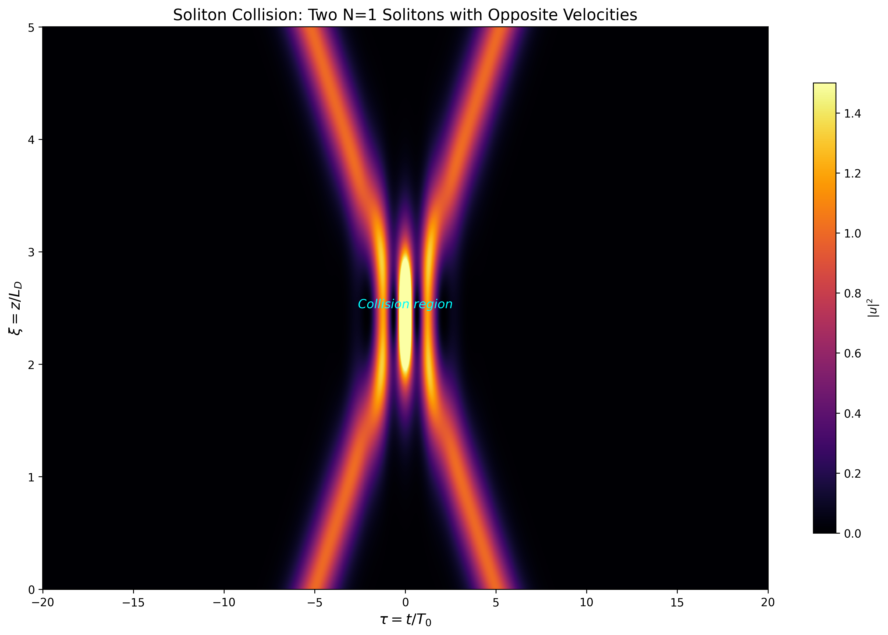
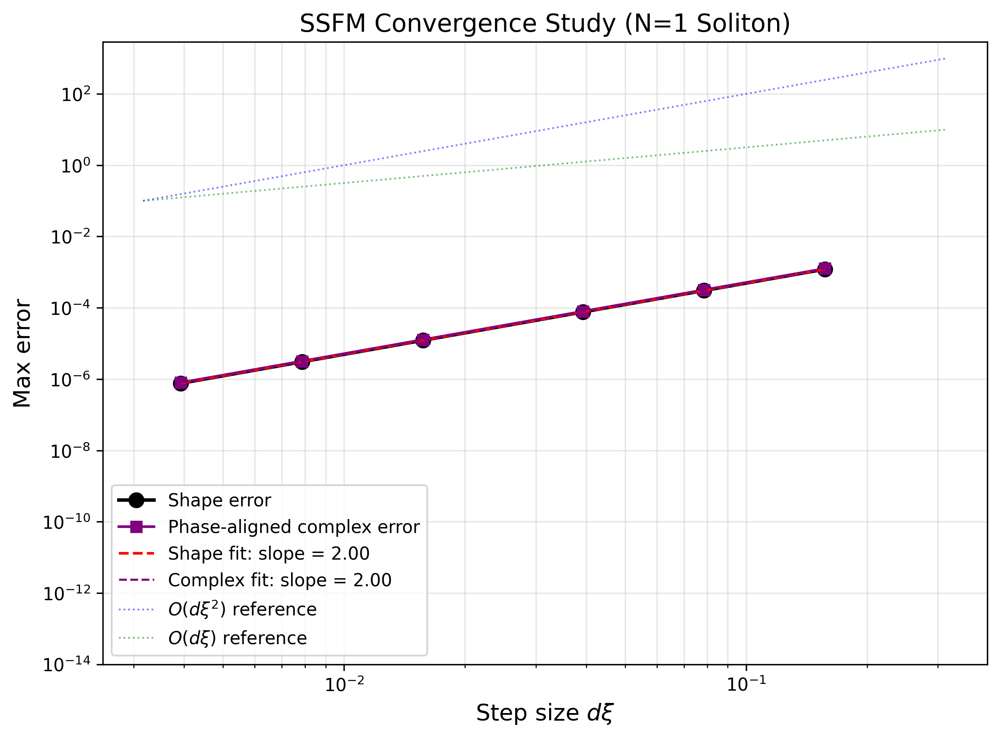
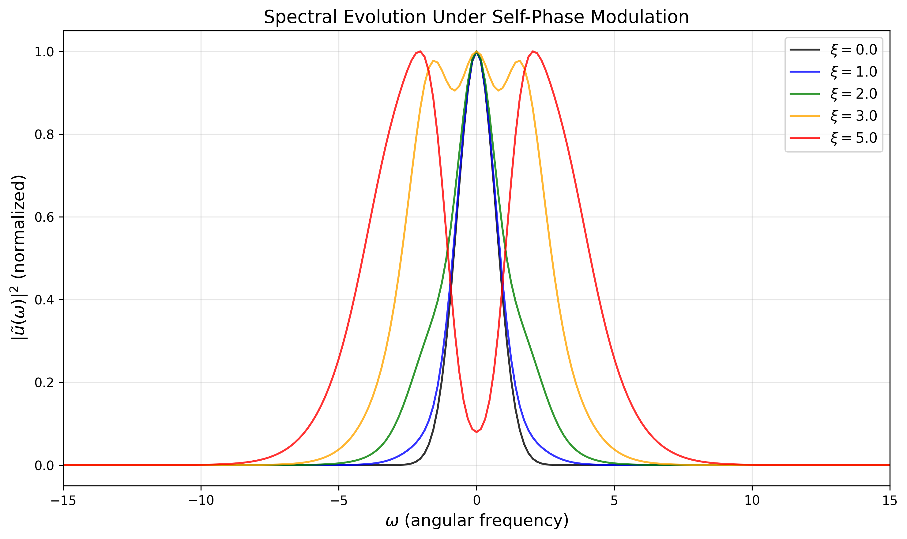
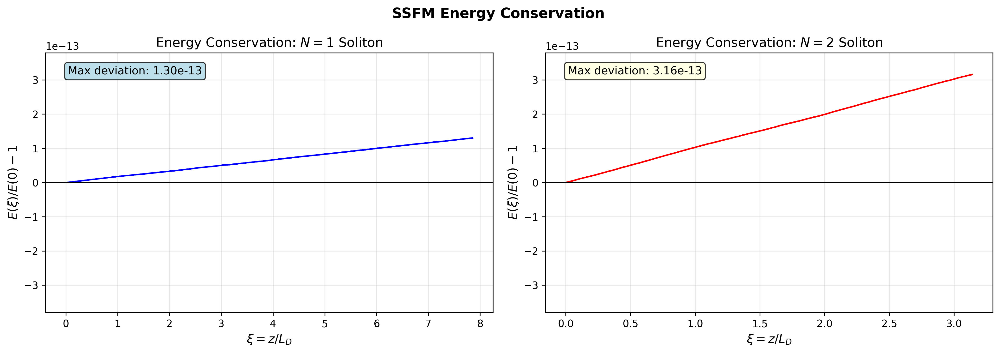

# Split-Step Fourier Solver for Nonlinear Fiber Optics

A Python implementation of the symmetric split-step Fourier method (SSFM) for solving
the nonlinear Schrödinger equation (NLSE) — the master equation governing optical pulse
propagation in fibers. Demonstrates dispersion, self-phase modulation, soliton dynamics,
and soliton collisions.

## The Physics

The NLSE describes how an optical pulse evolves in a nonlinear dispersive fiber:

$$i\frac{\partial u}{\partial \xi} + \frac{s}{2}\frac{\partial^2 u}{\partial \tau^2} + N^2|u|^2 u = 0$$

Two competing effects — **group velocity dispersion** (temporal broadening) and
**self-phase modulation** (spectral broadening) — can form a self-consistent nonlinear
balance in anomalous dispersion. The fundamental result is the optical **soliton**:
a pulse that propagates without changing shape.

## Key Results

### Soliton Propagation: N=1, 2, 3

*Left: Fundamental soliton (N=1) — unchanged. Center: N=2 — periodic breathing.
Right: N=3 — complex multi-peak dynamics.*

### Soliton Collision

*Two solitons collide and recover their shapes within numerical tolerance — the hallmark of integrability in the ideal NLSE.*

### Solver Validation

*Second-order convergence confirmed via log-log analysis (slope ≈ 2).*

### More Results

*Self-phase modulation broadens the spectral intensity while temporal intensity remains fixed.*

*The SSFM preserves the NLSE energy invariant to floating-point precision.*

